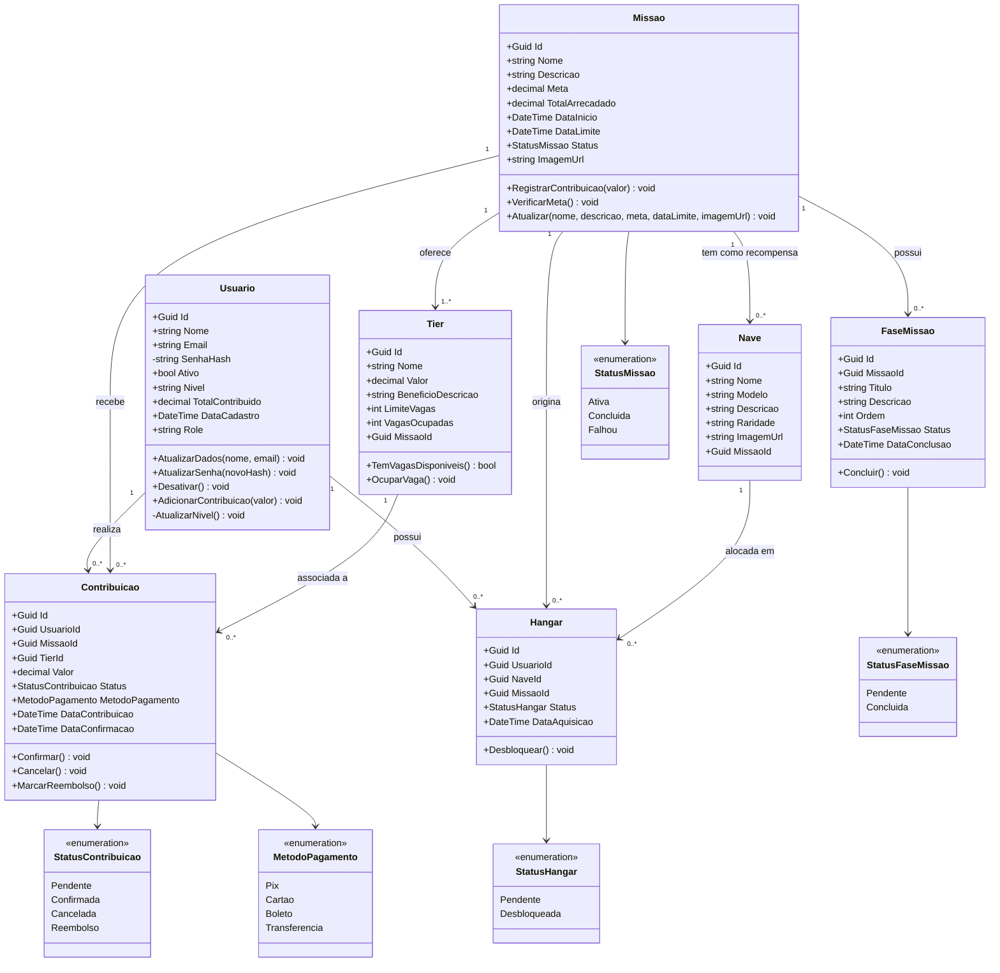

# StarForge API

> **FIAP — Global Solution 2026/1 · Advanced Business Development with .NET**
Links arquitetura: https://youtu.be/NiTM72Upums
> 
Vídeo Pitch: https://youtu.be/4ADkytuLn3k
## Turma: 2TDSPW

| Integrante | RM |
|---|---|
| Anna Clara Russo Luca | 561928 |
| Gabriel Duarte Maciel | 565754 |
| Gustavo Tavares | 562827 |
| Tiago Guedes da Costa | 564731 |

---

Plataforma de **crowdfunding espacial** para missões interestelares. Pilotos se cadastram, escolhem missões ativas, contribuem financeiramente selecionando um tier de recompensa e, quando a missão atinge a meta, recebem uma nave espacial desbloqueada no hangar. A API cobre todo o ciclo: cadastro de usuários com progressão de nível, gerenciamento de missões e tiers pelo administrador, ciclo completo de contribuições (pendente → confirmada), hangar de naves e fases de missão.

---

## Stack

| Camada | Tecnologia |
|---|---|
| Framework | ASP.NET Core 9 (Web API) |
| ORM | EF Core 9 + Oracle.EntityFrameworkCore 9.x |
| Banco de dados | Oracle Database (oracle.fiap.com.br:1521/orcl) |
| Autenticação | JWT Bearer — BCrypt.Net-Next para hash de senhas |
| Documentação | Scalar (tema DeepSpace) em `/scalar/v1` |
| Testes | xUnit + Moq — 24 testes (14 unitários + 10 integração) |

---

## Arquitetura — Clean Architecture

```
┌────────────────────────────────────────────────────────────────┐
│                        StarForge.API                           │
│  8 Controllers · 2 Middlewares · Program.cs (composição raiz) │
└───────────────────────────────┬────────────────────────────────┘
                                 │  depende apenas de interfaces (DIP)
┌───────────────────────────────▼────────────────────────────────┐
│                    StarForge.Application                        │
│   8 Services · 8 Repository Interfaces · 8 Service Interfaces  │
│   19 DTOs com Data Annotations · 3 Exceções mapeadas           │
└──────────────────┬────────────────────────────┬────────────────┘
                   │                             │
┌──────────────────▼──────────┐  ┌──────────────▼───────────────┐
│     StarForge.Domain         │  │   StarForge.Infrastructure    │
│  7 Entidades · 5 Enums       │  │   7 Repositórios EF Core      │
│  Rich Domain Model           │  │   7 Configurations Oracle     │
│  DomainException             │  │   DbContext · DbContextFactory │
└─────────────────────────────┘  └──────────────────────────────┘
```

**Regras de dependência:**
- **Domain** — zero dependências externas; contém as regras de negócio puras
- **Application** — depende de Domain e de interfaces abstratas (nunca de Infrastructure)
- **Infrastructure** — implementa as interfaces definidas em Application
- **API** — orquestra tudo via injeção de dependência; depende apenas de Application

---

## Padrões Aplicados

| Padrão | Onde e como |
|---|---|
| Repository Pattern | `IRepositoryBase<T>` + 7 interfaces específicas em Application; implementações EF Core em Infrastructure |
| Rich Domain Model | Private setters + métodos de domínio em todas as entidades (`Confirmar`, `Cancelar`, `MarcarReembolso`, `OcuparVaga`, `Desbloquear`, `VerificarMeta`) |
| Guard Clauses | `DomainException` em `Tier.OcuparVaga()`, `Contribuicao.Confirmar()`, `Contribuicao.MarcarReembolso()` |
| Soft Delete | `Ativo = false` em `Usuario` — conta desativada mas dados preservados |
| ProblemDetails RFC 7807 | `ExceptionHandlingMiddleware` mapeia todas as exceções para respostas padronizadas |
| DIP | Todos os serviços dependem de interfaces — zero acoplamento a implementações concretas |

---

## Instalação e Como Rodar

### Pré-requisitos

- [.NET 9 SDK](https://dotnet.microsoft.com/download/dotnet/9.0)
- Oracle Database acessível — a connection string aponta para `oracle.fiap.com.br:1521/orcl`

### 1. Clonar o repositório

```bash
git clone https://github.com/Tiagozguedes/starforge-.net.git
cd starforge-.net
```

### 2. Criar o arquivo de credenciais locais

Crie o arquivo **`src/StarForge.API/appsettings.Development.local.json`** com suas credenciais Oracle:

```json
{
  "ConnectionStrings": {
    "DefaultConnection": "User Id=SEU_RM;Password=SUA_SENHA;Data Source=oracle.fiap.com.br:1521/orcl;"
  },
  "Jwt": {
    "Key": "StarForge@SuperSecretKey256BitsMinimum!!",
    "Issuer": "StarForge.API",
    "Audience": "StarForge.Client",
    "ExpirationHours": 8
  }
}
```

> **Este arquivo está no `.gitignore` e nunca é commitado.** Substitua `SEU_RM` pelo seu RM FIAP (ex.: `rm564731`) e `SUA_SENHA` pela sua senha Oracle.

### 3. Restaurar dependências e compilar

```bash
dotnet restore
dotnet build
```

Resultado esperado: **Build succeeded. 0 Error(s).**

### 4. Aplicar as migrations no Oracle

```bash
dotnet ef database update \
  --project src/StarForge.Infrastructure \
  --startup-project src/StarForge.API
```

Isso cria todas as 7 tabelas no schema Oracle (`TB_USUARIO`, `TB_MISSAO`, `TB_TIER`, `TB_NAVE`, `TB_FASE_MISSAO`, `TB_CONTRIBUICAO`, `TB_HANGAR`).

### 5. Subir a API

```bash
dotnet run --project src/StarForge.API
```

A API sobe nas portas:
- **HTTPS:** `https://localhost:7262`
- **HTTP:** `http://localhost:5212`

### 6. Acessar a documentação interativa

Abra no browser: **`https://localhost:7262/scalar/v1`**

A interface Scalar (tema DeepSpace) exibe todos os endpoints com exemplos de request/response.

### 7. Executar os testes

```bash
dotnet test
```

Resultado esperado: **24 testes passando, 0 falhando.**

> Os testes de integração usam `WebApplicationFactory` com banco InMemory — **não requerem Oracle nem credenciais.**

---

## Testes no Postman

### Configuração inicial

1. Abra o Postman e crie um novo **Environment** chamado `StarForge Local`
2. Adicione as seguintes variáveis de ambiente:

| Variável | Valor inicial |
|---|---|
| `base_url` | `https://localhost:7262` |
| `token` | _(preenchido automaticamente após o login)_ |

3. Em **Settings**, habilite **"SSL certificate verification: OFF"** para aceitar o certificado de desenvolvimento HTTPS.

---

### Auth

#### POST — Login (obter token JWT)

```
Método:  POST
URL:     {{base_url}}/api/auth/login
Headers: Content-Type: application/json
```

**Body (raw → JSON):**
```json
{
  "email": "seu@email.com",
  "senha": "SuaSenha@123"
}
```

**Resposta esperada (200 OK):**
```json
{
  "token": "eyJhbGciOiJIUzI1NiIsInR5cCI6IkpXVCJ9...",
  "expiration": "2026-06-10T10:30:00Z",
  "usuario": {
    "id": "550e8400-e29b-41d4-a716-446655440000",
    "nome": "Seu Nome",
    "email": "seu@email.com",
    "nivel": "RECRUTA",
    "role": "Admin"
  }
}
```

> Copie o valor de `token` e cole na variável de ambiente `token` do Postman. Todos os demais endpoints usam `{{token}}` automaticamente.

---

### Usuários

#### POST — Criar usuário (público)

```
Método:  POST
URL:     {{base_url}}/api/usuarios
Headers: Content-Type: application/json
```

**Body (raw → JSON):**
```json
{
  "nome": "Seu Nome",
  "email": "seu@email.com",
  "senha": "SuaSenha@123",
  "role": "Admin"
}
```

#### GET — Listar usuários

```
Método:  GET
URL:     {{base_url}}/api/usuarios
Headers: Authorization: Bearer {{token}}
```

#### GET — Buscar por ID

```
Método:  GET
URL:     {{base_url}}/api/usuarios/{{usuario_id}}
Headers: Authorization: Bearer {{token}}
```

#### PUT — Atualizar usuário

```
Método:  PUT
URL:     {{base_url}}/api/usuarios/{{usuario_id}}
Headers: Content-Type: application/json
         Authorization: Bearer {{token}}
```

**Body (raw → JSON):**
```json
{
  "nome": "Nome Atualizado",
  "email": "novo@fiap.com.br"
}
```

#### DELETE — Desativar conta (soft delete)

```
Método:  DELETE
URL:     {{base_url}}/api/usuarios/{{usuario_id}}
Headers: Authorization: Bearer {{token}}
```

---

### Missões

#### GET — Listar todas as missões (público)

```
Método:  GET
URL:     {{base_url}}/api/missoes
```

#### GET — Listar apenas missões ativas (público)

```
Método:  GET
URL:     {{base_url}}/api/missoes/ativas
```

#### GET — Buscar missão por ID (público)

```
Método:  GET
URL:     {{base_url}}/api/missoes/{{missao_id}}
```

#### POST — Criar missão (Admin)

```
Método:  POST
URL:     {{base_url}}/api/missoes
Headers: Content-Type: application/json
         Authorization: Bearer {{token}}
```

**Body (raw → JSON):**
```json
{
  "nome": "Missão Proxima Centauri",
  "descricao": "Primeira expedição interstelar tripulada rumo à Proxima Centauri b.",
  "meta": 50000.00,
  "dataInicio": "2026-07-01T00:00:00Z",
  "dataLimite": "2026-12-31T23:59:59Z",
  "imagemUrl": "https://exemplo.com/proxima.jpg"
}
```

> **RN-003:** `dataInicio` deve ser anterior a `dataLimite` — caso contrário, retorna 422.

#### PUT — Atualizar missão (Admin)

```
Método:  PUT
URL:     {{base_url}}/api/missoes/{{missao_id}}
Headers: Content-Type: application/json
         Authorization: Bearer {{token}}
```

**Body (raw → JSON):** mesmo formato do POST.

#### DELETE — Remover missão (Admin)

```
Método:  DELETE
URL:     {{base_url}}/api/missoes/{{missao_id}}
Headers: Authorization: Bearer {{token}}
```

---

### Tiers

#### GET — Listar todos os tiers (público)

```
Método:  GET
URL:     {{base_url}}/api/tiers
```

#### GET — Tiers de uma missão (público)

```
Método:  GET
URL:     {{base_url}}/api/tiers/missao/{{missao_id}}
```

#### POST — Criar tier (Admin)

```
Método:  POST
URL:     {{base_url}}/api/tiers
Headers: Content-Type: application/json
         Authorization: Bearer {{token}}
```

**Body (raw → JSON):**
```json
{
  "nome": "Pioneiro",
  "valor": 1000.00,
  "beneficioDescricao": "Nave Explorador Classe A + nome na placa memorial da missão",
  "limiteVagas": 50,
  "missaoId": "{{missao_id}}"
}
```

---

### Naves

#### GET — Listar todas as naves (público)

```
Método:  GET
URL:     {{base_url}}/api/naves
```

#### GET — Naves de uma missão (público)

```
Método:  GET
URL:     {{base_url}}/api/naves/missao/{{missao_id}}
```

#### POST — Cadastrar nave (Admin)

```
Método:  POST
URL:     {{base_url}}/api/naves
Headers: Content-Type: application/json
         Authorization: Bearer {{token}}
```

**Body (raw → JSON):**
```json
{
  "nome": "Aurora Prime",
  "modelo": "Classe A — Explorador",
  "descricao": "Nave de exploração de longo alcance com motor de dobra experimental.",
  "raridade": "Épico",
  "missaoId": "{{missao_id}}",
  "imagemUrl": "https://exemplo.com/aurora-prime.jpg"
}
```

---

### Contribuições

**Ciclo de vida de uma contribuição:**

```
[1] POST /api/contribuicoes           →  status: Pendente   (hangar criado como Pendente)
[2] PUT  /api/contribuicoes/confirmar →  status: Confirmada (nível do piloto atualizado;
                                                              hangar desbloqueado se meta atingida)
[3] DELETE /api/contribuicoes/cancelar →  status: Cancelada  (hangar pendente removido)
```

#### POST — Registrar contribuição

```
Método:  POST
URL:     {{base_url}}/api/contribuicoes
Headers: Content-Type: application/json
         Authorization: Bearer {{token}}
```

**Body (raw → JSON):**
```json
{
  "usuarioId": "{{usuario_id}}",
  "missaoId": "{{missao_id}}",
  "tierId": "{{tier_id}}",
  "valor": 1000.00,
  "metodoPagamento": 0
}
```

> `metodoPagamento`: `0 = Pix` · `1 = Cartão` · `2 = Boleto` · `3 = Transferência`

#### PUT — Confirmar contribuição

```
Método:  PUT
URL:     {{base_url}}/api/contribuicoes/confirmar/{{contribuicao_id}}
Headers: Authorization: Bearer {{token}}
```

#### DELETE — Cancelar contribuição

```
Método:  DELETE
URL:     {{base_url}}/api/contribuicoes/cancelar/{{contribuicao_id}}
Headers: Authorization: Bearer {{token}}
```

#### GET — Contribuições por usuário

```
Método:  GET
URL:     {{base_url}}/api/contribuicoes/usuario/{{usuario_id}}
Headers: Authorization: Bearer {{token}}
```

#### GET — Minhas contribuições (extraído do JWT)

```
Método:  GET
URL:     {{base_url}}/api/contribuicoes/minha
Headers: Authorization: Bearer {{token}}
```

---

### Hangar

#### GET — Meu hangar (extraído do JWT)

```
Método:  GET
URL:     {{base_url}}/api/hangar
Headers: Authorization: Bearer {{token}}
```

#### GET — Item específico do hangar

```
Método:  GET
URL:     {{base_url}}/api/hangar/{{hangar_id}}
Headers: Authorization: Bearer {{token}}
```

---

### Fases da Missão

#### GET — Fases de uma missão (público)

```
Método:  GET
URL:     {{base_url}}/api/fases/missao/{{missao_id}}
```

#### POST — Criar fase (Admin)

```
Método:  POST
URL:     {{base_url}}/api/fases
Headers: Content-Type: application/json
         Authorization: Bearer {{token}}
```

**Body (raw → JSON):**
```json
{
  "missaoId": "{{missao_id}}",
  "titulo": "Lançamento da Sonda Pioneira",
  "descricao": "Envio da sonda de mapeamento orbital para análise do exoplaneta.",
  "ordem": 1
}
```

#### PUT — Concluir fase (Admin — irreversível)

```
Método:  PUT
URL:     {{base_url}}/api/fases/concluir/{{fase_id}}
Headers: Authorization: Bearer {{token}}
```

---

## Regras de Negócio

| Código | Descrição | Implementação |
|---|---|---|
| RN-001 | E-mail único — cadastro rejeitado se e-mail já existe | `UsuarioService.CriarAsync` → 422 |
| RN-002 | `DataInicio` deve ser anterior a `DataLimite` ao criar missão | `MissaoService.CriarAsync` → 422 |
| RN-003 | Missão só aceita contribuições com status `Ativa` | `ContribuicaoService.CriarAsync` → 422 |
| RN-004 | Tier esgotado não aceita mais contribuições | `Tier.OcuparVaga()` → `DomainException` → 422 |
| RN-005 | Confirmar contribuição: ocupa vaga no tier + atualiza nível do piloto + registra arrecadação | `ContribuicaoService.ConfirmarAsync` |
| RN-006 | Missão concluída (meta atingida): todos os hangares da missão desbloqueados automaticamente | `ContribuicaoService.ConfirmarAsync` |
| RN-007 | Missão falhou (prazo expirado sem meta): contribuições pendentes marcadas para `Reembolso` | `ContribuicaoService.ConfirmarAsync` |
| RN-008 | Cancelar contribuição remove o hangar pendente associado — evita registro órfão | `ContribuicaoService.CancelarAsync` |
| RN-009 | Nível calculado automaticamente: RECRUTA (<R$100) / OPERATIVO (R$100–499) / VETERANO (R$500–1999) / COMANDANTE (≥R$2.000) | `Usuario.AdicionarContribuicao()` |

---

## Diagrama de Classes



---

## Testes

### Suites de Teste

| Suite | Arquivo | Testes | O que valida |
|---|---|---|---|
| Unitário — Domain | `UsuarioTests.cs` | 6 | Progressão de nível RECRUTA→COMANDANTE, acúmulo de contribuições, soft delete |
| Unitário — Domain | `MissaoTests.cs` | 5 | `VerificarMeta()` — meta exata, superada, não atingida e prazo expirado; acúmulo de arrecadação |
| Unitário — Domain | `TierTests.cs` | 4 | `OcuparVaga()` — incremento, esgotamento com `DomainException`, `TemVagasDisponiveis()` |
| Unitário — Service | `ContribuicaoServiceTests.cs` | 4 | Contribuição em missão inativa lança `BusinessRuleException`; atualização de nível ao confirmar; missão concluída ao atingir meta; desbloqueio de hangares |
| Integração | `AuthControllerTests.cs` | 3 | Credenciais válidas → 200 + JWT; senha errada → 422; e-mail inexistente → 422 |
| Integração | `UsuariosControllerTests.cs` | 2 | POST com dados válidos retorna 201 com nível RECRUTA; e-mail duplicado retorna 422 |
| **Total** | | **24** | |

### Executar os Testes

```bash
# Todos
dotnet test

# Apenas unitários
dotnet test tests/StarForge.UnitTests

# Apenas integração (sem Oracle — usa InMemory)
dotnet test tests/StarForge.IntegrationTests

# Com saída detalhada
dotnet test --logger "console;verbosity=detailed"
```

> Os testes de integração usam `WebApplicationFactory<Program>` com `UseInMemoryDatabase` — **não requerem Oracle nem credenciais.**

---

## Tratamento de Erros

Todos os erros seguem o padrão **RFC 7807 ProblemDetails** via `ExceptionHandlingMiddleware`:

| Exceção | HTTP | Quando ocorre |
|---|---|---|
| `NotFoundException` | 404 | Entidade não encontrada pelo ID informado |
| `BusinessRuleException` | 422 | Regra de negócio violada (missão inativa, tier esgotado, e-mail duplicado, etc.) |
| `ValidationException` | 400 | Dados de entrada inválidos (Data Annotations) |
| `Exception` (genérica) | 500 | Erro inesperado |

**Exemplo de resposta de erro (422):**
```json
{
  "type": "https://tools.ietf.org/html/rfc7807",
  "title": "Regra de negócio violada",
  "status": 422,
  "detail": "A missão não está ativa para receber contribuições.",
  "instance": "/api/contribuicoes"
}
```

---

## Estrutura do Projeto

```
starforge-.net/
├── src/
│   ├── StarForge.Domain/
│   │   ├── Entities/            # Usuario, Missao, Tier, Nave, FaseMissao, Contribuicao, Hangar
│   │   ├── Enums/               # StatusMissao, StatusContribuicao, StatusHangar,
│   │   │                        #   MetodoPagamento, StatusFaseMissao
│   │   └── Exceptions/          # DomainException
│   │
│   ├── StarForge.Application/
│   │   ├── Interfaces/          # IRepositoryBase<T> + 7 interfaces de repositório
│   │   ├── Interfaces/Services/ # IAuthService + 7 interfaces de serviço
│   │   ├── Services/            # AuthService, UsuarioService, MissaoService, TierService,
│   │   │                        #   NaveService, ContribuicaoService, HangarService, FaseMissaoService
│   │   ├── DTOs/                # Records com Data Annotations (input) e DTOs de resposta (output)
│   │   └── Exceptions/          # NotFoundException (404) · BusinessRuleException (422) · ValidationException (400)
│   │
│   ├── StarForge.Infrastructure/
│   │   ├── Data/                # StarForgeDbContext · StarForgeDbContextFactory (migrations)
│   │   ├── Data/Configurations/ # 7 IEntityTypeConfiguration com mapeamento Oracle completo
│   │   ├── Migrations/          # InitialCreate — cria as 7 tabelas com FKs e índices
│   │   └── Repositories/        # RepositoryBase<T> + 7 repositórios concretos
│   │
│   └── StarForge.API/
│       ├── Controllers/         # AuthController, UsuariosController, MissoesController,
│       │                        #   TiersController, NavesController, ContribuicoesController,
│       │                        #   HangarController, FasesMissaoController
│       ├── Middlewares/         # ExceptionHandlingMiddleware (RFC 7807) · RequestLoggingMiddleware
│       └── Program.cs           # Composição raiz: DI, JWT, Scalar, pipeline de middlewares
│
└── tests/
    ├── StarForge.UnitTests/       # 14 testes — xUnit + Moq (sem I/O, sem Oracle)
    └── StarForge.IntegrationTests/ # 10 testes — WebApplicationFactory + EF InMemory
```

---

## Integrantes

**Turma:** 2TDSPW

| Nome | RM |
|---|---|
| Anna Clara Russo Luca | 561928 |
| Gabriel Duarte Maciel | 565754 |
| Gustavo Tavarez | 562827 |
| Tiago Guedes da Costa | 564731 |
